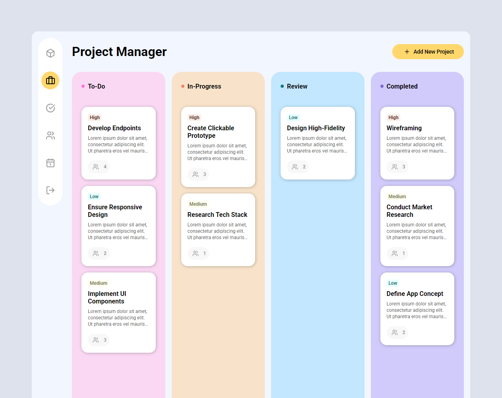

Project Management Tool (TypeScript)
====================================

A robust, object-oriented Task Management application built entirely with **TypeScript**. This project demonstrates advanced TypeScript features, including custom decorators, abstract classes, and the Singleton design pattern to manage application state.



🚀 Key Features
---------------

-   **Drag-and-Drop Interface**: Seamlessly move tasks between "To-do", "In-progress", "Review", and "Completed" columns using native HTML5 Drag and Drop API.

-   **State Management**: A custom-built, centralized state management system utilizing the **Singleton Pattern** and **Listeners** (Observer Pattern).

-   **Form Validation**: Comprehensive input validation for project titles, descriptions, and team size.

-   **OOP Architecture**: Built using inherited base components to ensure DRY (Don't Repeat Yourself) code.

🛠️ Technical Deep Dive
-----------------------

### **TypeScript Features Used**

-   **Classes & Inheritance**: Utilized an `abstract` base `Component` class to handle common DOM rendering logic for all UI elements.

-   **Interfaces**: Defined strict contracts for `Draggable` and `DragTarget` entities to ensure type safety during drag-and-drop actions.

-   **Decorators**: Implemented a custom `@Autobind` decorator to automatically bind the `this` keyword to methods, avoiding common JavaScript pitfalls with event listeners.

-   **Generics**: Used Generics in the base `Component` class to allow flexible yet type-safe element selection.

-   **Enums**: Managed project statuses using `ProjectStatus` enums for better code readability and maintainability.

### **Architecture**

The project is split into logical modules:

-   `/models`: Data structures and interfaces.

-   `/components`: UI logic and DOM manipulation.

-   `/state`: The "Source of Truth" for application data.

-   `/util`: Helper functions like the validation engine.

-   `/decorators`: Custom logic to enhance class functionality.

📦 Installation & Setup
-----------------------

1.  **Clone the repository:**

    Bash

    ```
    git clone https://github.com/joeldedwards/project-management-dnd-ts.git

    ```

2.  **Install dependencies:** *(Note: Ensure you have a local server or a bundler like Webpack/Vite if you plan to extend this. Currently, it runs via native ES modules.)*

3.  **Compile TypeScript:**

    Bash

    ```
    tsc -w

    ```

4.  **Run the app:** Open `index.html` using a local development server (like Live Server in VS Code).

📝 License
----------

Distributed under the MIT License.